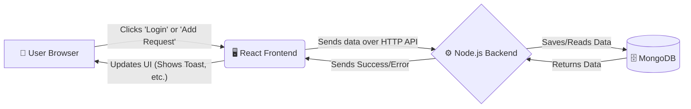

# Najhak.io Client Request Dashboard

## Project Overview
Welcome to the Najhak.io Technical Test submission! This is a Full Stack application built to manage client requests. It allows managers and admins to securely log in, view a beautiful dashboard of their client requests, add new requests, and update statuses seamlessly.

## 🏗️ Architecture & Workflow (In a Nutshell)

We built this app using the **MERN** stack (MongoDB, Express, React, Node.js). Here is a simple, non-technical look at how it all connects:

- **Frontend (React)**: The user interface you see and click on. It's built for speed and beauty.
- **Backend (Node.js/Express)**: The "brain" of the app. It listens to the frontend and processes logic.
- **Database (MongoDB)**: The digital filing cabinet where all users and client requests are stored safely.



## 🛠️ Approaches We Took

### The Frontend Approach (React + Vite)
- **Speed & Smoothness**: We used React to build a Single Page Application (SPA). This means the page never awkwardly reloads. When you change a status, we use "Optimistic Updates"—the UI updates instantly so it feels lightning fast, while saving to the database in the background.
- **Responsive & Premium UI**: We focused heavily on modern aesthetics. The app features glassmorphism, gradient styling, custom animated toast notifications, and slick loaders. Everything scales beautifully from mobile to ultra-wide screens.
- **User Isolation**: The frontend acts intelligently. When you log in, the app stores a custom token. It uses this token to prove to the backend exactly who you are, ensuring you only ever see your own data.

### The Backend Approach (Node.js + Express)
- **MVC Pattern**: We organized the backend into Models (Data rules), Controllers (Business logic), and Routes (Traffic cops). This keeps the code clean and easy to read.
- **Performance (Pagination & Aggregation)**: We don't just dump all data to the frontend. The backend paginates data (sending 10 items at a time) and uses MongoDB Aggregation Pipelines to instantly count statistics. This means even if you have 1,000,000 requests, the app will load instantly.
- **Custom Authentication**: Per the task rules ("no auth libraries"), we built a lightweight, clever custom authentication system. We encode the user's ID into a Base64 Token, which acts like a VIP pass. The backend checks this pass on every request to keep data secure and isolated per user.


## 🚀 Future Enhancements (Making it "Real World" Ready)

While this app proves the core concepts, preparing it for millions of users in a strict corporate environment requires upgrades:

### 1. Enterprise Security
- **Real Authentication**: We would replace our custom Base64 tokens with standard **JSON Web Tokens (JWT)** or **OAuth2** (Google/SSO login). 
- **Encryption**: Passwords must be hashed using `bcrypt` before hitting the database.
- **Validation & Rate Limiting**: We would add strict payload validation (`Zod` or `Joi`) to prevent malicious injections, and rate limit APIs to prevent DDoS attacks.

### 2. Advanced Authorization & RBAC (Role-Based Access Control)
- **Role Hierarchy**: We would implement a strict RBAC system where users are assigned distinct roles (e.g., `SuperAdmin`, `Manager`, `Client`). 
- **Granular Permissions**: Instead of just checking if a user is logged in, we would attach specific permissions to roles (e.g., `canCreateRequest`, `canUpdateStatus`, `canViewAllUsers`). The backend middleware would explicitly intercept and check these permissions before executing any API logic.
- **Frontend Guarding**: The React UI would dynamically render components. If a user doesn't have the `canUpdateStatus` permission, the "Update Status" buttons would be completely hidden from their dashboard, providing a foolproof user experience.

### 3. Scalability & Performance
- **Microservices Architecture**: Instead of one monolithic backend, we would split it up. E.g., an `Auth Service` and a `Request Service`.
- **Caching Layer**: We would introduce **Redis** to cache the dashboard statistics so the database doesn't have to recount everything every second.
- **State Management**: On the frontend, we would use **Redux Toolkit** or **Zustand** for massive-scale state management.

### 4. DevOps & CI/CD
- **Containerization**: Everything would be wrapped in **Docker** containers so it runs identically on any machine, orchestrated by Kubernetes.
- **Automated Testing**: We would write hundreds of Jest unit tests that run automatically on every GitHub push to ensure zero bugs make it to production.

---

## 💻 Step-by-Step Installation Guide

Anyone can get this project running in 3 minutes!

### Prerequisites
1. **Node.js** installed on your computer.
2. **MongoDB** installed and running locally on port `27017` (the default port).

### Step 1: Start the Backend (Server)

rename .env.example to .env and input your mongodb URI in it.
and input your pot number.
Open your terminal and run these commands:
```bash
cd server
npm install
npm run dev
```
*Note: As soon as the backend starts, it automatically seeds the database with the mock users.*

### Step 2: Start the Frontend (Client)
Open a **new** terminal window and run these commands:
```bash
cd client
npm install
npm run dev
```

### Step 3: Login!
Open your browser and navigate to the link provided by Vite (usually `http://localhost:5173`). 

Use one of the seeded mock accounts to log in:
- **Email:** `admin@najhak.io`
- **Password:** `password123`

*(You can also use `manager@najhak.io` to see how the data is perfectly isolated!)*

---

## 📁 Project Structure

Here is a quick overview of how the code is organized:

### Backend (`/server`)
```text
server/
├── config/           # Database connection logic
├── controllers/      # Business logic (handling requests/responses)
├── middleware/       # Custom Auth and Error handling interceptors
├── models/           # Mongoose Database Schemas
├── routes/           # Express API endpoints
├── .env.example      # Environment variables template
├── seeder.js         # Script to auto-populate mock users
└── server.js         # Entry point for the Node.js application
```

### Frontend (`/client`)
```text
client/
├── public/           # Static assets (favicons)
├── src/
│   ├── assets/       # Images and SVGs
│   ├── components/   # Reusable UI pieces (Header, Toast, RequestForm)
│   ├── pages/        # Main views (Login, Dashboard)
│   ├── services/     # Axios configuration and API calls
│   ├── App.jsx       # React Router setup & Route guarding
│   └── main.jsx      # React DOM entry point
└── package.json      # Frontend dependencies & scripts
```
